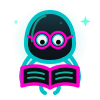
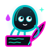
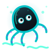
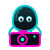
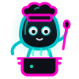
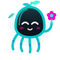
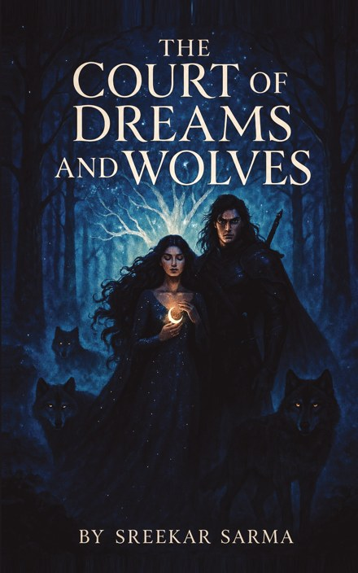

  

  

  

---

## 🐙 Ahoy, I'm sreekar. you can also call me octy

> *an octopus has three hearts, nine brains and blue blood.*
> *i've got one of each, so i make up for it with curiosity and way too many open tabs.*

- studying **CSE** (B.Tech, Mohan Babu University) and **Data Science** (BS, IIT Madras), at the same time
- deep in the trench with **ChainGuard**, my capstone. it fuses several SBOM generators and vulnerability scanners into one CI/CD security gate
- i build the behind-the-scenes stuff for **Sahityika**, the literary society of the IIT Madras BS programme: email templates, a reading-session archive and other tidy things
- i also write poems and stories as **Random Dreamer**, and one of them grew into a whole [book](#ink-sac)
- happy to talk about anything, from black holes and parallel universes to java, python and machine learning, a good book, or the weirdest fact you learned this week. the stranger the better 🛸

---

## 🌊 when i'm not at the keyboard

*eight arms, eight hobbies.*

<table>
  <tr>
    <td align="center" width="25%"> <b>reading</b> always halfway through something</td>
    <td align="center" width="25%"> <b>writing</b> poems, stories, the occasional novel</td>
    <td align="center" width="25%"> <b>gaming</b> swordigo, CoC, CODM, minecraft, shadow fight 2 & many more</td>
    <td align="center" width="25%"> <b>music</b> headphones on, world off</td>
  </tr>
  <tr>
    <td align="center" width="25%"> <b>swimming</b> the closest i get to being octy</td>
    <td align="center" width="25%"> <b>photography</b> eight arms, one steady shot</td>
    <td align="center" width="25%"> <b>cooking</b> stirring several pots at once</td>
    <td align="center" width="25%"> <b>nature</b> happiest somewhere green, or blue</td>
  </tr>
</table>

---

## 🖋️ from the ink sac

*octopuses squirt ink when they're nervous. i use mine to write.*

<table>
  <tr>
    <td width="32%" align="center">
      
    </td>
    <td>
      <h3>The Court of Dreams and Wolves</h3>
      
by <b>Random Dreamer</b> (Sreekar Sarma)

      <blockquote><i>Some doors only open in dreams. Some should never be opened at all.</i></blockquote>
      

         
         
        
      

    </td>
  </tr>
</table>

<h3 align="center">how far is the soon?</h3>

<i>
I asked the Stars how far is the soon 
They giggled and hid far behind the moon. 
The soon they said is a tricky race 
It hides in time, not in place. 
 
I asked the Sun, with all golden and bright 
It feels so near, yet out of sight. 
The sun smiled and said you'll see it bloom, 
When patience dances with a tune. 
 
I asked the Wind as softly she flew 
Tell me when The soon comes true!!?? 
She breezed gently saying, hold on tight! 
The soon is born from waiting right!? 
 
So now I sit beneath the moon, 
Still wondering, How far's the soon? 
 
Maybe Soon or Maybe late, 
I'll smile and say, It was worth the wait.
</i>

— By a Random Dreamer —

---

## 🦑 the eight arms

<table>
  <tr>
    <td align="center" width="25%">🛡️ <b>supply-chain security</b> SBOMs, scanners, policy gates</td>
    <td align="center" width="25%">🤖 <b>machine learning</b> models, maths, many notebooks</td>
    <td align="center" width="25%">🎧 <b>audio ML</b> teaching a model to hear birds</td>
    <td align="center" width="25%">🌐 <b>web apps</b> Vue in front, Flask / Django behind</td>
  </tr>
  <tr>
    <td align="center">⚡ <b>APIs</b> FastAPI, served on Vercel</td>
    <td align="center">🧰 <b>automation</b> messy exports in, tidy records out</td>
    <td align="center">✉️ <b>email design</b> Unlayer templates that look good</td>
    <td align="center">📖 <b>literature</b> reading, writing, reading sessions</td>
  </tr>
</table>

---

## 🐚 treasures on the seabed

| | project | what it does | built with |
|:-:|---|---|---|
| 🐦 | [**bird-finder**](https://github.com/sreekarsarma55/bird-finder) | upload a recording and it tells you which birds are singing, with timestamps and spectrograms | Python · Streamlit · TensorFlow Lite (BirdNET) |
| 🧩 | [**Quiz-Master-V2**](https://github.com/sreekarsarma55/Quiz-Master-V2) | a full quiz platform with an admin side, a user side and background jobs | Vue · Flask · Redis · Celery |
| ⚡ | [**vercel-deploys**](https://github.com/sreekarsarma55/vercel-deploys) | live FastAPI endpoints, including a working MCP server and a plain-English ledger Q&A | Python · FastAPI · Vercel |
| 📚 | [**readingsession_updator**](https://github.com/sreekarsarma55/readingsession_updator) | turns Sahityika's chat export into a sorted archive of every reading session | Python (standard library only) |
| 🗒️ | [**notes**](https://github.com/sreekarsarma55/notes) | my knowledge base, with one branch per subject | Markdown · LaTeX |

---

## 🫧 surfacing soon

*little bubbles are rising from the deep. here's a sneak peek of what's coming up.*

| | what's brewing | the gist | depth gauge |
|:-:|---|---|---|
| 🏝️ | **personal website** | a small island on the internet for my projects, my writing and this octopus | `▰▰▰▱▱▱▱▱` charting the map |
| 🕵️ | **steganography tool** | hides secret messages inside ordinary images, in plain sight, the way an octopus hides against a rock | `▰▰▱▱▱▱▱▱` ink still drying |
| 🛡️ | **ChainGuard** | multi-tool SBOMs, fused vulnerability scans and a policy gate that passes or fails your build | `▰▰▰▰▱▱▱▱` diving... no vulnerability survives this deep |
| 🦑 | **& several more** | there's a lot still in the ink sac. no spoilers. | `▱▱▱▱▱▱▱▱` classified |

  
🍾 <i>you found a message in a bottle. open it?</i>

   

  > if you scrolled this far, you're basically part of the crew now.
  > star a repo, open an issue, or just wave a tentacle 👋
  >
  > *p.s. the octopus is called octy jr.*
  > *he says hi.*

---

## 🧰 the toolbox

  

---

  

