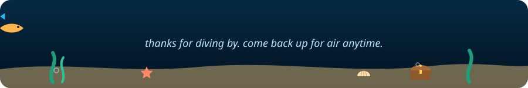

  

  

  

---

## 🐙 ahoy, i'm sreekar

> *an octopus has three hearts, nine brains and blue blood.*
> *i've got one of each, so i make up for it with curiosity and way too many open tabs.*

- 🎓 studying **CSE** (B.Tech, Mohan Babu University) and **Data Science** (BS, IIT Madras), at the same time
- 🛡️ deep in the trench with **ChainGuard**, my capstone. it fuses several SBOM generators and vulnerability scanners into one CI/CD security gate
- 📚 i build the behind-the-scenes stuff for **Sahityika**, the literary society of the IIT Madras BS programme: email templates, a reading-session archive and other tidy things
- 🧠 i keep my study notes on ML and data science out in the open in [`notes`](https://github.com/sreekarsarma55/notes)
- 💬 happy to talk about python, supply-chain security, machine learning, or a good book

---

## 🦑 the eight arms

<table>
  <tr>
    <td align="center" width="25%">🛡️ <b>supply-chain security</b> SBOMs, scanners, policy gates</td>
    <td align="center" width="25%">🤖 <b>machine learning</b> models, maths, many notebooks</td>
    <td align="center" width="25%">🎧 <b>audio ML</b> teaching a model to hear birds</td>
    <td align="center" width="25%">🌐 <b>web apps</b> Vue in front, Flask behind</td>
  </tr>
  <tr>
    <td align="center">⚡ <b>APIs</b> FastAPI, served on Vercel</td>
    <td align="center">🧰 <b>automation</b> messy exports in, tidy records out</td>
    <td align="center">✉️ <b>email design</b> Unlayer templates that look good</td>
    <td align="center">📖 <b>literature</b> reading, writing, reading sessions</td>
  </tr>
</table>

---

## 🐚 treasures on the seabed

| | project | what it does | built with |
|:-:|---|---|---|
| 🐦 | [**bird-finder**](https://github.com/sreekarsarma55/bird-finder) | upload a recording and it tells you which birds are singing, with timestamps and spectrograms | Python · Streamlit · TensorFlow Lite (BirdNET) |
| 🧩 | [**Quiz-Master-V2**](https://github.com/sreekarsarma55/Quiz-Master-V2) | a full quiz platform with an admin side, a user side and background jobs | Vue · Flask · Redis · Celery |
| ⚡ | [**vercel-deploys**](https://github.com/sreekarsarma55/vercel-deploys) | live FastAPI endpoints, including a working MCP server and a plain-English ledger Q&A | Python · FastAPI · Vercel |
| 📚 | [**readingsession_updator**](https://github.com/sreekarsarma55/readingsession_updator) | turns Sahityika's chat export into a sorted archive of every reading session | Python (standard library only) |
| 🗒️ | [**notes**](https://github.com/sreekarsarma55/notes) | my knowledge base, with one branch per subject | Markdown · LaTeX |

---

## 🫧 surfacing soon

*little bubbles are rising from the deep. here's a sneak peek of what's coming up.*

| | what's brewing | the gist | depth gauge |
|:-:|---|---|---|
| 🏝️ | **personal website** | a small island on the internet for my projects, my writing and this octopus | `▰▰▰▱▱▱▱▱` charting the map |
| 🕵️ | **steganography tool** | hides secret messages inside ordinary images, in plain sight, the way an octopus hides against a rock | `▰▰▱▱▱▱▱▱` ink still drying |
| 🛡️ | **ChainGuard** | multi-tool SBOMs, fused vulnerability scans and a policy gate that passes or fails your build | `▰▰▰▰▱▱▱▱` phase 1 of the dive |
| 🦑 | **& several more** | there's a lot still in the ink sac. no spoilers. | `▱▱▱▱▱▱▱▱` classified |

  
🍾 <i>you found a message in a bottle. open it?</i>

   

  > if you scrolled this far, you're basically part of the crew now.
  > star a repo, open an issue, or just wave a tentacle 👋
  >
  > *p.s. the octopus is called Inky. Inky says hi.*

---

## 🧰 the toolbox

  

---

  

